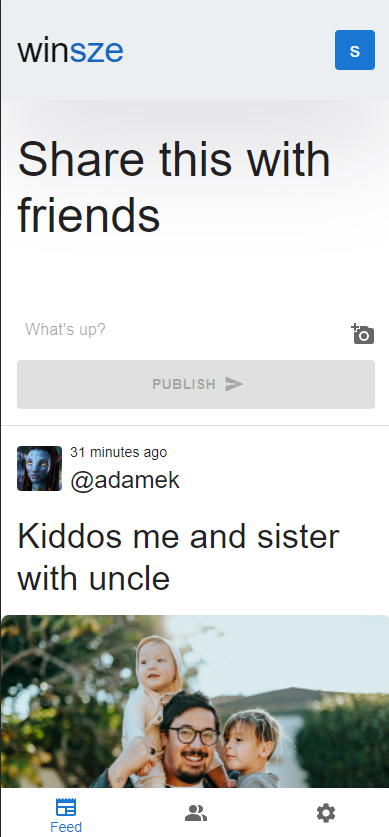

<h1 align="center">

 

winsze

 
 

</h1>

<h4 align="center">winsze - social app</h4>

  

## Project Overview 🎉

Winsze social app, is a progressive web app built using ReactJS and Firebase
(CRUD).

## Tech/framework used 🔧

| Tech             | Description           |
| ---------------- | --------------------- |
| React            | Main JS Library       |
| Firebase         | Serverless backend    |
| Jest             | Unit Tests            |
| Jest             | E2E Tests             |
| React Router Dom | Routing               |
| Emotion          | Styling (css in js)   |
| Material UI      | Styling (components)  |
| React Hot Toast  | Notifications         |
| React Moment     | Improved date display |

## Screenshots 📺

    

## Firebase 🔥

### Posts firestore

| Name          | Type   | Description                        |
| ------------- | ------ | ---------------------------------- |
| id            | string | uuidv4 generated when posting      |
| authorId      | string | uid from Firebase Auth             |
| date          | string | date in iso generated when posting |
| author        | string | displayName from Firebase Auth     |
| avatar        | string | photoURL from Firebase Auth        |
| description   | string | content entered by user            |
| photo         | string | content selected by user           |
| likes         | number | like counter                       |
| usersWhoLiked | array  | array containing users id          |

### Users firestore

| Name         | Type   | Description                                                   |
| ------------ | ------ | ------------------------------------------------------------- |
| avatar       | string | photoURL from Firebase Auth                                   |
| id           | string | uid from Firebase Auth                                        |
| nickname     | string | displayName from Firebase Auth                                |
| registerDate | string | and if it doesn't exist then the email address cut off at '@' |

### Storage

| Name            | Type | Description                               |
| --------------- | ---- | ----------------------------------------- |
| PhotosPosts     | img  | Images for posts, saved using the post id |
| ProfilePictures | img  | Images for posts, saved using the user id |

## Installation 💾

## Available scripts

| Command         | Description            |
| --------------- | ---------------------- |
| `npm run start` | Open local server      |
| `npm run build` | Create optimized build |
| `npm run test`  | Run jest tests         |
| `npm run cy`    | Run cypress test       |

## Live 📍

https://winsze.web.app/

## License 🔱

GPL 3.0
