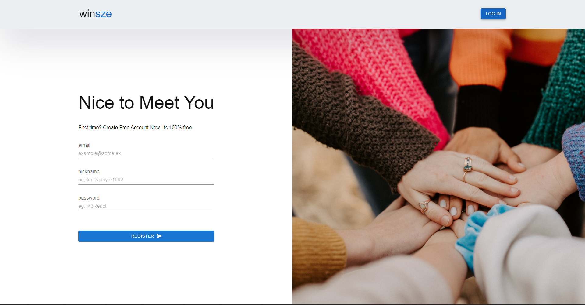
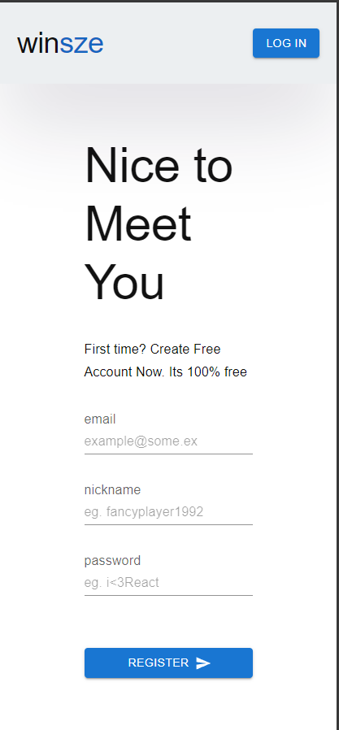

<h1 align="center">

<br>

<p align="center">

</p>

<br>

<br>

</h1>

<h4 align="center">winsze - social app</h4>

<p align="center">
  <a >
    
  </a>
</p>

## Project Overview 🎉

## Tech/framework used 🔧

| Tech             | Description          |
| ---------------- | -------------------- |
| React            | JS Library           |
| Jest             | Test                 |
| React Router Dom | Routing              |
| Firebase         | Serverless backend   |
| Emotion          | Styling (css in js)  |
| Material UI      | Styling (components) |
| React Hot Toast  | Notifications        |

## Screenshots 📺

<p align="center">
    
</p>

<p align="center">
    
</p>

<p align="center">
    
</p>

## Code Example/Issues 🔍

customHooks:

```javascript
function useLocalStorageState(name, initValue = null) {
  const getValueFromLocalStorage = window.localStorage.getItem(name)

  const [state, setState] = useState(
    name !== 'undefined' ? JSON.parse(getValueFromLocalStorage) : null,
  )

  useEffect(() => {
    window.localStorage.setItem(name, JSON.stringify(state))
  }, [name, state])

  return [state, setState]
}

function useOverflowHidden() {
  return useEffect(() => {
    document.querySelector('body').style.overflow = 'hidden'
    return () => {
      document.querySelector('body').style.overflow = 'visible'
    }
  }, [])
}
```

## Installation 💾

## Available scripts

| Command         | Description            |
| --------------- | ---------------------- |
| `npm run start` | Open local server      |
| `npm run build` | Create optimized build |
| `npm run test`  | Run tests              |

## Live 📍

## License 🔱
